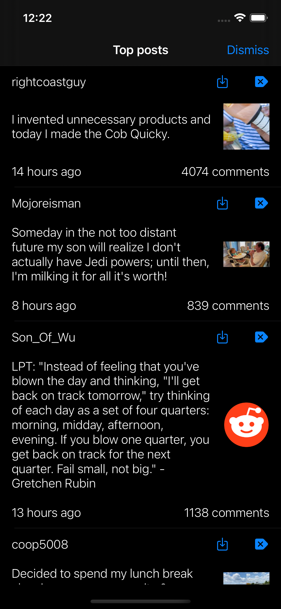

# RedditDemoApp

No additional setup is required. The only third-party library used was KeychainSwift in order to store the access token and was manually added. 

## Screenshots

### iOS

 

### iPadOS

# Contributing

Feel free to open an issue or submit a pull request if you have any improvement or feedback.

# Author

Alonso Alvarez, alonso.alvarez.dev@gmail.com
